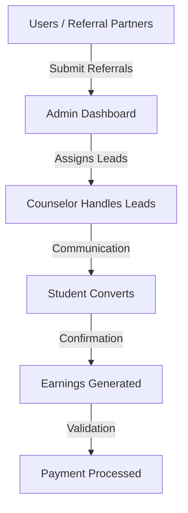

# 🚀 TTS ADMIN DASHBOARD — Referral CRM & Business OS

## 🧠 1. WHAT THIS ADMIN DASHBOARD REALLY IS
This is **NOT** just a simple dashboard. It is a comprehensive **Lead → Conversion → Revenue → Payment Management System**.

In simpler terms, it is a:
**Referral CRM + Sales System + Finance System (All-in-One SaaS)**

## 🔥 2. CORE PURPOSE OF THE SYSTEM
This system streamlines the entire business lifecycle for TTS:
*   🎯 **Collect Leads**: Gather referrals from partners.
*   📞 **Follow-up**: Manage counselor communications.
*   🎓 **Convert Students**: Confirm admissions.
*   💰 **Calculate Earnings**: Auto-generate commission data.
*   💵 **Pay Referral Partners**: Process financial payouts.

Everything is controlled through this centralized Admin Dashboard.

## 🏗️ 3. COMPLETE SYSTEM ARCHITECTURE

The Admin Dashboard acts as the **Control Center** for the entire pipeline.

## 🔥 4. USER ROLES (Access Control)
### 👑 Super Admin
*   Full system control including user management.
*   Role assignment and system monitoring.
*   Master data configuration.

### 📞 Counselor (Core Operational Role)
*   Lead verification and student communication.
*   Status updates and conversion tracking.
*   Maintains the sales pipeline.

### 👤 Referral Partner
*   Referral submission and tracking.
*   Real-time earnings monitoring.

### 🧑💼 Admin / Manager
*   Operational support and managerial oversight.

## 🔷 5. ADMIN DASHBOARD MODULES
*   **🟢 User Management**: Control access, approve signups, and manage role-based permissions.
*   **🟡 Referral / Lead Management**: The entry point where all inbound leads are stored and tracked.
*   **🔵 Follow-up Module (Core 🔥)**: The "engine room" where leads are nurtured into admissions.
*   **🟣 Course Master**: The foundation where pricing, curriculum, and commission bases are defined.
*   **🟠 Offers Module**: Marketing engine to trigger discounts and campaigns to boost conversions.
*   **💰 Earnings Module**: Real-time revenue tracking and commission calculations per referral.
*   **💵 Payments Module**: Financial logs for processing payouts and maintaining payment history.
*   **⚙️ Commission Master**: The logic center for percentage-based or fixed-amount earning rules.
*   **📊 Reports & Analytics**: Deep business insights into conversion rates and monthly performance.

## 🔥 6. COMPLETE BUSINESS FLOW
1.  **User Signup** & Admin Approval.
2.  **Referral Submission** by Partner.
3.  **Lead Verification** by Counselor.
4.  **Omnichannel Follow-ups** (WhatsApp/Email/Call).
5.  **Student Conversion** & Admission Confirmation.
6.  **Automatic Earnings Calculation**.
7.  **Payment Processing** & Payout History Update.

## 🔷 7. DATA FLOW (System Level)
**Course Master** → **Offer Module** → **Referral Module** → **Follow-up Module** → **Earnings Module** → **Payments Module**

## 🔥 8. WHAT MAKES THIS SYSTEM POWERFUL
*   ✅ **Role-Based System**: Secure access for different staff types.
*   ✅ **Dynamic Offers**: Flexible marketing tools.
*   ✅ **Real-time Earnings**: Instant transparency for partners.
*   ✅ **Lead tracking**: End-to-end visibility from interest to payment.

**This is a Startup-Level SaaS Product 🚀**

## 🔷 9. REAL-WORLD COMPARISON
This system combines the best features of:
*   **Lead CRM** (like Zoho or HubSpot).
*   **Affiliate Management Systems**.
*   **Training Institute ERPs**.

## 🔴 10. CURRENT STATUS & NEXT STEPS
*   ✅ **UI/UX Design**: Successfully completed with premium dashboard aesthetics.
*   ✅ **Frontend Logic**: Interactive modals, filtering, and navigation implemented.
*   🚀 **Next Step**: Backend API Integration (Spring Boot/Database Design).

---
**Design by [Technokraft Services LLP](https://www.technokraftservices.com/) | TechnoKraft Training & Solution Pvt. Ltd.**
